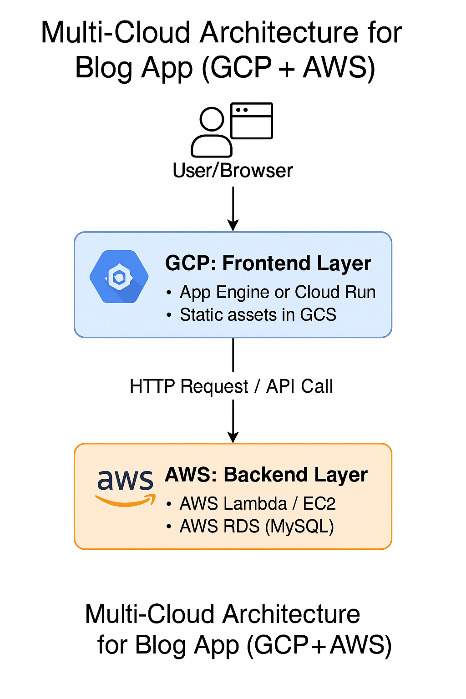

# Task 3: Multi-Cloud Architecture – GCP + AWS

## Objective
To design and demonstrate a working multi-cloud application architecture that connects a frontend hosted on **Google Cloud Storage (GCP)** to a backend Flask API hosted on an **AWS EC2 instance**.

---

## Architecture Overview

- **Frontend**: Static HTML hosted in a GCP Cloud Storage bucket
- **Backend**: Flask API running on AWS EC2
- **Communication**: HTTP call from GCP to AWS
- **CORS** enabled to allow cross-origin requests

---

## Architecture Diagram

---

## Steps Performed

### 🔹 AWS (Backend)
- Launched EC2 instance with Amazon Linux 2023
- Installed Python, Flask, and Flask-CORS
- Ran API on port 80 returning `Hello from AWS EC2 Flask Backend!`
- Configured security group to allow HTTP access (port 80)

### 🔹 GCP (Frontend)
- Created a static HTML page that makes an HTTP fetch call to the AWS EC2 API
- Uploaded it to a GCP bucket
- Made the file public and accessed it via the bucket's public URL

---

## Demo

🔗 [Click to view frontend (GCP)](http://storage.googleapis.com/your-bucket-name/index.html)

📡 Backend Response:
> Hello from AWS EC2 Flask Backend!

---

## Screenshots

| Screenshot                  | Description                           |
|----------------------------|---------------------------------------|
| `architecture-diagram.png` | Visual layout of the system           |
| `ec2-running.png`          | AWS EC2 instance in running state     |
| `flask-output.png`         | Browser showing backend response      |
| `frontend-html.png`        | GCP bucket hosting index.html         |
| `api-call-success.png`     | Final API output on frontend          |

---

## Tools Used

- Google Cloud Platform: Cloud Storage
- Amazon Web Services: EC2
- Flask (Python)
- Flask-CORS (for CORS support)
